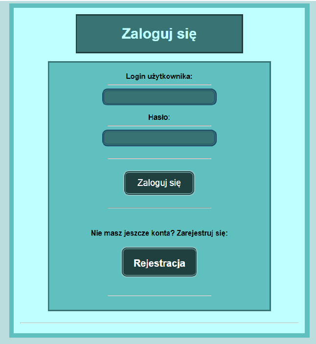
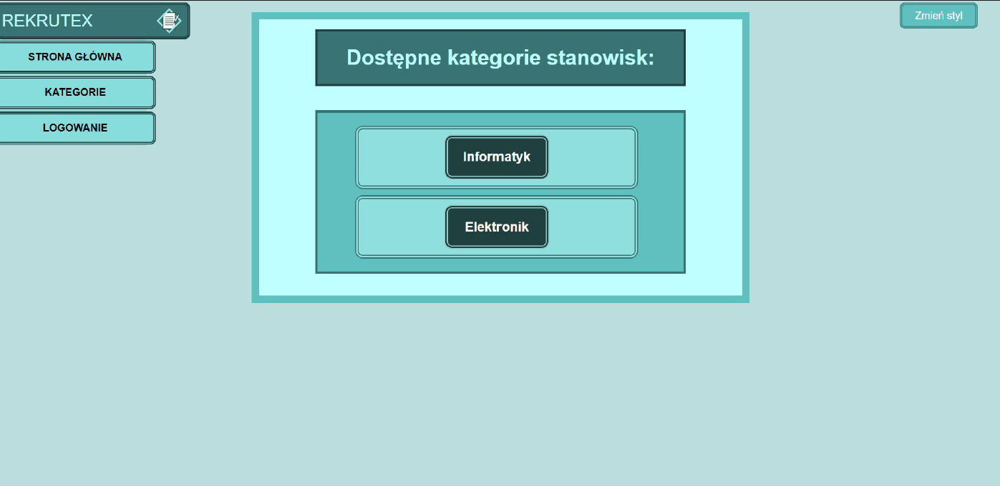
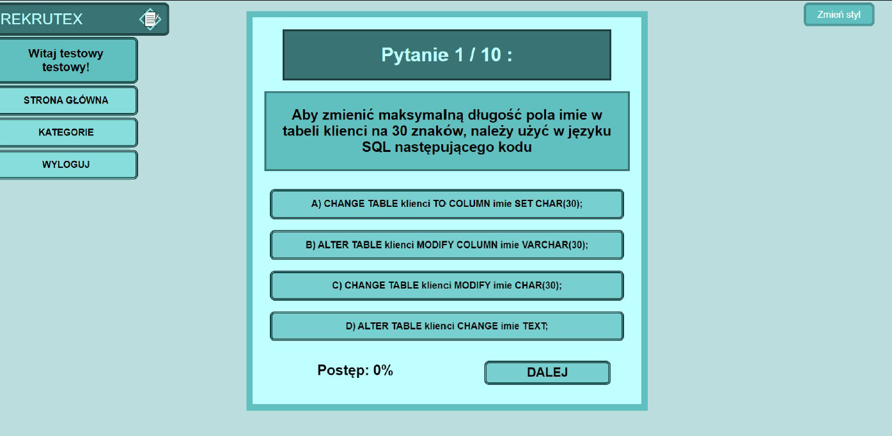
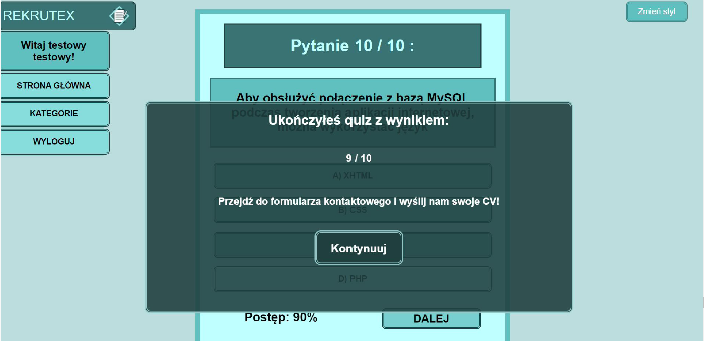
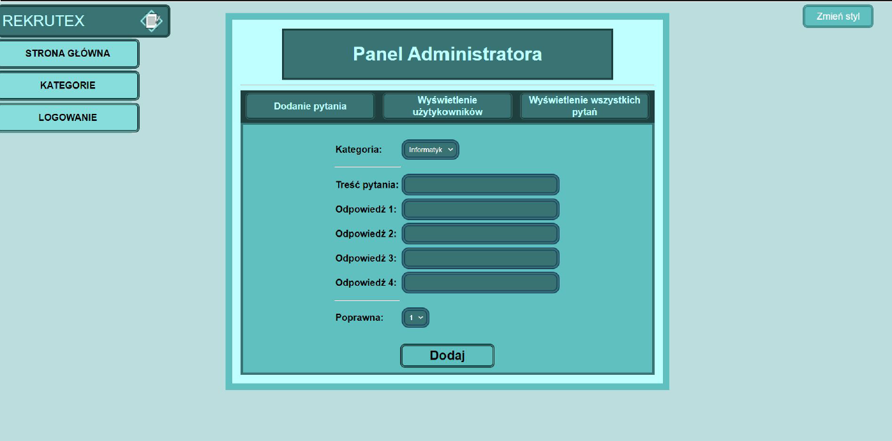

# Rekrutex
Web application for improving recruitment process.  
Group project for university classes.  
>App developed: April - June 2022

## Table of Contents
* [General Info](#general-information)
* [Technologies Used](#technologies-used)
* [Features](#features)
* [Screenshots](#screenshots)
* [Project Status](#project-status)

## General Information
Web application, created as a group project for university classes, with purpose of practicing agile project developement.  
The concept of this application focuses on solving the problems of preliminary knowledge testing of candidates during recruitment process.  
To achieve that application provides means for testing users with defined by administrator test sets relevant to a specific job.  
Frontend of this application is based on Angular app and backend on PHP API.  
Database used was MySQL database hosted on remotemysql.com, but currently is not available anymore.  
  
My contribution to this project focused on:  
- Creating base structure of Angular application with routing and implementing most of app UI
- Connecting PHP API with database and ensuring connection between API and frontend
- Users login and registration handling (frontend and backend)
- Storing current user in session
- Restricting access to certain app features for not logged in users
- Displaying administrating panel only for user with administrator account
- Displaying all defined categories for test sets
- Quiz handling - displaying questions, saving user answers and validating them, displaying results and redirecting to contact form
- Adding users ranking for administrator panel
- Adding app UI themes

## Technologies Used
- Angular - version 13.3.2
- PHP
- MySQL

## Features
App features:
- User login and register forms
- Viewing categories of test sets available in app
- Solving tests (test questions are always in random order, after solving all questions user answers are validated and results are displayed)
- Redirecting user to contact form after passing the test with qualifying results
- Contact form for user to send in cv and other required information
- Administrator panel available for user with administrator account, allowing creating new test sets, checking users ranking and displaying all available questions in already created test sets
- Restricting access to test sets for not logged in user
- Storing current user in session
- Changing app theme

## Screenshots

User login form:

Displaying available test categories:

Test solving:

Test results:

Administrator panel:

## Project Status
Project is: _complete_  
Currently project is completed. All planned features have been implemented.  
Project was developed from April 2022 to June 2022.
